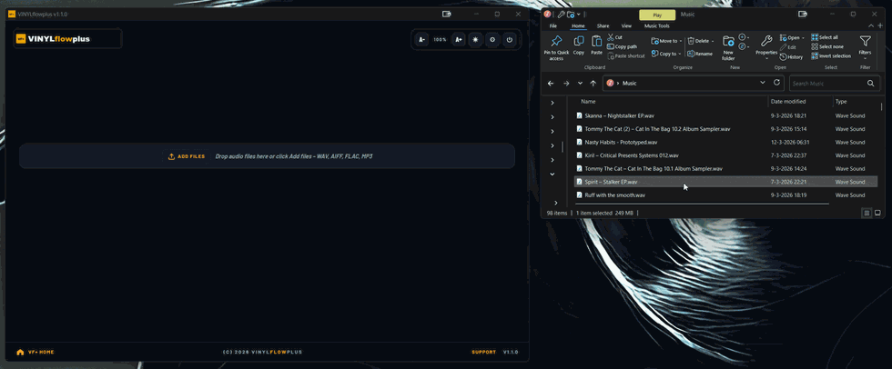
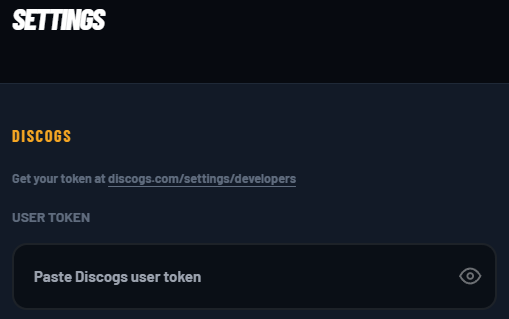

# 🎵 VINYLflowplus

> [!NOTE]
> **VINYLflowplus** is an enhanced fork of the original [VINYLflow](https://github.com/olimic1000/vinylflow) by [olimic1000](https://github.com/olimic1000). This version includes additional features, improved naming conventions, and better metadata handling for professional vinyl digitization workflows.

**Digitize vinyl 10x faster. Open source.**

Turn your vinyl recordings into perfectly tagged, organized digital files in minutes — not hours. VINYLflowplus automates track splitting, Discogs metadata tagging, cover art embedding, and vinyl-style numbering (A1, A2, B1, B2).



---

## Use VINYLflowplus

- 🖥️ **Desktop apps:** install builds from [vinylflowplus.app/install](https://vinylflowplus.app/install)
- 🐳 **Docker (self-hosted):** run locally via [Quick Start (Docker)](#quick-start-docker)
- ⚙️ **Python local mode:** see [Manual Setup (Non-Docker)](#manual-setup-non-docker)

---

## The Problem

Digitizing a vinyl record manually takes **20–30 minutes per album**: record in Audacity, manually find track boundaries, split, export, look up metadata, type it all in, find cover art, embed it. Multiply that by a collection of hundreds of records and it's a weekend project that never ends.

## The Solution

VINYLflowplus does it in **3 minutes**. Upload your recording, let it detect the tracks, pick the album from Discogs, and hit process. Done.

---

## Features

- **Automatic silence detection** — intelligently finds track boundaries in your recording
- **Duration-based splitting** — fallback for seamlessly mixed tracks with no gaps
- **Discogs integration** — visual search with album artwork, metadata, and track listings
- **Multiple output formats** — FLAC (lossless), MP3 (320kbps), or AIFF (lossless)
- **Multiple input formats** — WAV and AIFF recordings supported
- **Vinyl-style numbering** — proper A1, A2, B1, B2 track notation
- **Cover art** — downloads and embeds album artwork automatically
- **Interactive waveform editor** — drag regions to fine-tune track boundaries
- **Batch queue** — process multiple records with real-time progress
- **Remote access** — control from any device on your network (phone, tablet, laptop)

---

## Quick Start (Docker)

**Recommended path:** Docker (stable). If you prefer local Python, see [Manual Setup (Non-Docker)](#manual-setup-non-docker).

### Prerequisites

You'll need:
- **Docker Desktop** (free) — [Download here](https://www.docker.com/products/docker-desktop/)

That's it! Git is optional (see Step 1 below). No need to mess with configuration files — VINYLflowplus will guide you through setup in your browser.

## 1. Get VINYLflowplus

### Option A: Download ZIP (easiest — no Git required)

1. Go to [github.com/flarkflarkflark/VINYLflowplus](https://github.com/flarkflarkflark/VINYLflowplus)
2. Click the green **Code** button, then **Download ZIP**
3. Unzip the folder to a location you can find (like your Downloads or Desktop)
4. Open the unzipped `vinylflowplus` folder

### Option B: Clone with Git (for terminal users)

```bash
git clone https://github.com/flarkflarkflark/VINYLflowplus.git
cd vinylflowplus
```

## 2. Start VINYLflowplus

1. **Open your terminal:**
   - **Mac:** Open "Terminal" app (or iTerm)
   - **Windows:** Open "Command Prompt" or "PowerShell"
   - **Linux:** Open your terminal application

2. **Navigate to the VINYLflowplus folder:**
   - If you downloaded the ZIP, type `cd ` (with a space after) and drag the `vinylflowplus` folder into the terminal window, then press Enter
   - Or type the full path, like: `cd ~/Downloads/vinylflowplus` or `cd C:\Users\YourName\Downloads\vinylflowplus`
   - **Windows shortcut:** In File Explorer, open the vinylflowplus folder, click the address bar, type `cmd` and press Enter

3. **Start VINYLflowplus:**
   ```bash
   docker compose up -d
   ```

4. **Open your browser** and go to **http://localhost:8000**

## 3. First-Run Setup

When you open VINYLflowplus for the first time, you'll see a welcome screen that guides you through setup in seconds:



1. **Get your free Discogs API token** — Click the link in the setup screen or visit [discogs.com/settings/developers](https://www.discogs.com/settings/developers)
2. **Generate a new token** — Click "Generate new token" on the Discogs settings page
3. **Copy and paste** — Paste your token into VINYLflowplus's setup screen
4. **Click Continue** — Done! VINYLflowplus validates the token and you're ready to digitize

**That's it!** 🎵 No hidden files, no terminal commands, no restart needed. Your token is saved securely and persists across Docker restarts.

**Tip:** You can update your token anytime from the Settings (⚙️) menu in VINYLflowplus.

## Desktop Apps (Beta)

VINYLflowplus desktop apps are available for macOS and Windows (beta track).

- Installer downloads: [vinylflowplus.app/install](https://vinylflowplus.app/install)

- Desktop beta work is published from `desktop-beta`
- `main` remains the stable Docker-first channel
- For local desktop mode, run: `python desktop_launcher.py`
- Packaging/release scripts are in `scripts/`

### Developer Branch Note

To avoid accidental promotion of beta app work:

- Open desktop feature PRs into `desktop-beta`
- Keep `main` for stable/docs/release-safe changes
- Promote desktop work to `main` only when explicitly ready

For full branching and release details, see [docs/BRANCHING_STRATEGY.md](docs/BRANCHING_STRATEGY.md).

---

## Manual Setup (Non-Docker)

For tech-savvy users who prefer managing their own Python environment.

### Prerequisites

You'll need to install these system dependencies first:

- **Python 3.11 or later**
- **FFmpeg** (handles all audio processing and format conversion: MP3, FLAC, AIFF)
- **FLAC encoder** (optional, provides dedicated FLAC encoding tools)
- **libsndfile1** (optional, audio I/O library)

**Installation by OS:**

**macOS** (using Homebrew):
```bash
brew install python@3.11 ffmpeg flac libsndfile
```

**Ubuntu/Debian**:
```bash
sudo apt-get update
sudo apt-get install python3.11 python3.11-venv ffmpeg flac libsndfile1-dev
```

**Windows**:
- Install [Python 3.11+](https://www.python.org/downloads/) (check "Add to PATH" during installation)
- Download [FFmpeg](https://ffmpeg.org/download.html) and add it to your PATH
- FLAC and libsndfile are bundled with FFmpeg on Windows

### Installation Steps

```bash
# 1. Clone the repository
git clone https://github.com/flarkflarkflark/VINYLflowplus.git
cd vinylflowplus

# 2. Create and activate a Python virtual environment
python3 -m venv venv
source venv/bin/activate  # On Windows: venv\Scripts\activate

# 3. Install Python dependencies
pip install -r requirements.txt

# 4. Start the server
python -m uvicorn backend.api:app --host 0.0.0.0 --port 8000
```

Open **http://localhost:8000** in your browser.

### First-Run Setup (Non-Docker)

Just like with Docker, VINYLflowplus will show you a welcome screen on first run:

1. Visit [discogs.com/settings/developers](https://www.discogs.com/settings/developers) and generate a free API token
2. Paste it into the VINYLflowplus setup screen
3. Click Continue — done!

Your token is saved to `config/settings.json` and works immediately without restart.

**Alternative (for advanced users):** You can still use a `.env` file if you prefer:

```bash
cp .env.example .env
```

Edit `.env` and add your token:

```ini
DISCOGS_USER_TOKEN=your_token_here
DEFAULT_OUTPUT_DIR=~/Music/VINYLflowplus
```

**Notes:**
- The `output/` and `temp_uploads/` directories are created automatically
- You can adjust silence detection and other settings in `.env` (see [Configuration](#configuration) below)
- To stop the server, press `Ctrl+C` in the terminal

---

## How It Works

1. **Upload** — drag and drop your WAV or AIFF recording
2. **Analyze** — VINYLflowplus detects track boundaries using silence detection
3. **Search** — find your album on Discogs with visual artwork results
4. **Map** — match detected tracks to Discogs track listings
5. **Choose format** — FLAC, MP3, or AIFF output
6. **Process** — tracks are split, converted, tagged, and saved with cover art

Your files appear in the `output/` folder, organized as `Artist - Album/A1-Track Name.flac`.

---

## Output Example

```
output/
└── Aril Brikha - Departure/
    ├── A1-Groove La Chord.flac
    ├── A2-Art Of Vengeance.flac
    ├── B1-Ambiogenesis.flac
    ├── B2-Deeparture In Mars.flac
    └── folder.jpg
```

Each file includes embedded metadata: artist, album, title, track number, year, label, Discogs ID, and cover art.

---

## Who Is This For?

- **DJs** digitizing crate finds for digital sets
- **Vinyl collectors** preserving and cataloguing collections
- **Record labels** archiving back catalogs
- **Music lovers** who want their vinyl in lossless digital

---

## Configuration

**Discogs Token**: Managed via the web UI (Settings ⚙️ menu)

**Audio Processing Settings**: Adjust in the app via Settings (⚙️), or for advanced users, edit `config/settings.json` or `.env`:

```ini
# Silence detection (adjust if tracks aren't splitting correctly)
DEFAULT_SILENCE_THRESHOLD=-40      # dB — increase to -35 if tracks are merging
DEFAULT_MIN_SILENCE_DURATION=1.5   # seconds — decrease to 1.0 for short gaps
DEFAULT_MIN_TRACK_LENGTH=30        # seconds — ignore segments shorter than this

# FLAC compression (0-8, higher = smaller files)
DEFAULT_FLAC_COMPRESSION=8
```

**Config Priority**: `config/settings.json` (UI-editable) → `.env` (manual) → environment variables (Docker)

### Silence Detection Tips

| Problem | Fix |
|---|---|
| Tracks merging together | Increase threshold (e.g. `-35` instead of `-40`) |
| Too many splits | Decrease threshold (e.g. `-45` instead of `-40`) |
| Splitting on brief silence | Increase min silence duration (e.g. `2.0`) |

---

## Managing Docker

```bash
# View logs
docker compose logs -f

# Stop VINYLflowplus
docker compose stop

# Restart
docker compose restart

# Remove containers (keeps your files in ./output)
docker compose down
```

---

## Troubleshooting

**See the setup screen on first run?**
This is normal! VINYLflowplus guides you through adding your Discogs token via the web interface. Just follow the on-screen instructions — it takes 30 seconds.

**"command not found: git"?**
You don't need Git! Use the **Download ZIP** option in [Step 1](#1-get-vinylflowplus) instead.

**"command not found: docker"?**
Make sure Docker Desktop is installed and **running**. You should see the Docker icon in your system tray (Mac menu bar or Windows taskbar).

**Can't navigate to the VINYLflowplus folder in terminal?**
- **Mac/Linux:** Type `cd ` (with a space) and drag the vinylflowplus folder into the terminal window, then press Enter
- **Windows:** Open the vinylflowplus folder in File Explorer, click the address bar, type `cmd` and press Enter — this opens a terminal already in the right folder

**Container won't start?**
Check if port 8000 is in use: `lsof -i :8000` (Mac/Linux) or `netstat -ano | findstr :8000` (Windows). Change the port in `.env` with `PORT=8080`.

**Files not appearing in output/?**
Make sure the `output/` directory exists and has write permissions: `chmod -R 755 ./output`

**Discogs search returns no results?**
Your API token might be invalid or revoked. Click the Settings (⚙️) button and update your token, or generate a new one at [discogs.com/settings/developers](https://www.discogs.com/settings/developers)

**Tracks not splitting correctly?**
Try adjusting silence detection in Settings (⚙️), or use duration-based splitting after selecting a Discogs release.

---

## Technology Stack

| Component | Technology |
|---|---|
| Backend | Python, FastAPI, uvicorn |
| Audio processing | FFmpeg |
| Metadata tagging | Mutagen (FLAC, MP3, AIFF) |
| Music database | Discogs API |
| Frontend | Alpine.js, Tailwind CSS |
| Waveform display | WaveSurfer.js |
| Deployment | Docker |

---

## Roadmap

### Shipped (v1.0)
- Core digitization workflow
- Discogs integration with visual search
- Interactive waveform editor with draggable track boundaries
- Manual track splitting and deletion
- Vinyl-style track numbering (A1, A2, B1, B2)
- FLAC, MP3, and AIFF output
- WAV and AIFF input
- Duration-based splitting fallback
- WebSocket real-time progress
- Docker one-command setup
- **Web-based first-run setup** — no more hidden `.env` files!

### Planned
- BPM and key detection
- Rekordbox / Traktor export
- Click and pop removal
- MusicBrainz integration
- Cloud-hosted option

---

## Contributing

Found a bug? Have a feature idea? [Open an issue](https://github.com/flarkflarkflark/VINYLflowplus/issues) — contributions welcome.

---

## Credits & Acknowledgments

**VINYLflowplus** is a fork of the amazing [VINYLflow](https://github.com/olimic1000/vinylflow) project. Special thanks to the original author, **[olimic1000](https://github.com/olimic1000)**, for inventing such a powerful tool for the vinyl community. We are building on that solid foundation to bring even more features to vinyl enthusiasts everywhere.

---

## License

[MIT](LICENSE) — free to use, modify, and distribute.

---

**VINYLflowplus** — Built with ❤️ by DJs, for DJs.\n---\n\n**VINYLflowplus** — An evolution of the great [VINYLflowplus](https://github.com/olimic1000/vinylflow) invention. Built with ❤️ for DJs.
